Prometheus Team
====

Venezuelan team representing the José Felix Ribas Territorial Polytechnic University (UPTJFR).

## Content

* `t-photos` contains 2 photos of the team (an official one and one funny photo with all team members)
* `v-photos` contains 6 photos of the vehicle (from every side, from top and bottom)
* `video` contains the video.md file with the link to a video where driving demonstration exists
* `schemes` contains one or several schematic diagrams in form of JPEG, PNG or PDF of the electromechanical components illustrating all the elements (electronic components and motors) used in the vehicle and how they connect to each other.
* `src` contains code of control software for all components which were programmed to participate in the competition
* `models` is for the files for models used by 3D printers, laser cutting machines and CNC machines to produce the vehicle elements. If there is nothing to add to this location, the directory can be removed.
* `other` is for other files which can be used to understand how to prepare the vehicle for the competition. It may include documentation how to connect to a SBC/SBM and upload files there, datasets, hardware specifications, communication protocols descriptions etc. If there is nothing to add to this location, the directory can be removed.

## Introduction
For this competition, we're working on a comfortable, easy-to-modify, yet simple design where all the elements interact seamlessly with each other, featuring our first prototype of an autonomous vehicle with object and color recognition.
 
The design and construction of our vehicle is entirely our own, with a two-level structure designed so that all components fit together properly, removable support beams for easy disassembly if necessary, a transmission system to transmit power from the engine connected to the axle to the two rear wheels of the vehicle made with LEGO-type pieces, and a steering system with the same type of pieces controlled by a servomotor for greater precision when crossing.

This project was carried out by our team; every cable, every sensor, every line of code was made possible thanks to the technical and financial efforts of our team. We're not just building a vehicle; we're demonstrating that with passion and a desire to learn, you can push the boundaries.

## Hardware design
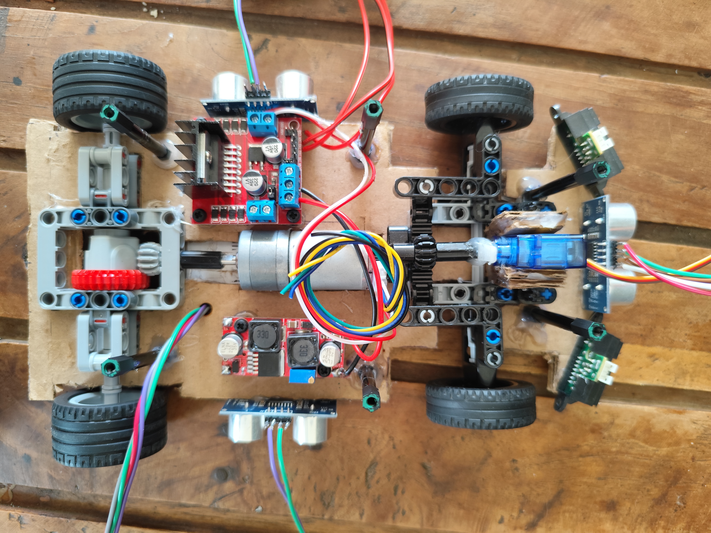

| Image | Component Name | Description |
|:------:|:----------------------|:------------|
| 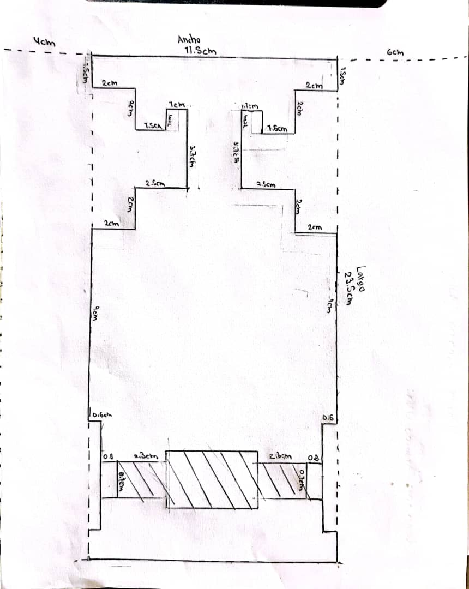 | **Vehicle base** | Through trial and error, we adjusted the dimensions of our base for better space distribution and vehicle mobility. |
| 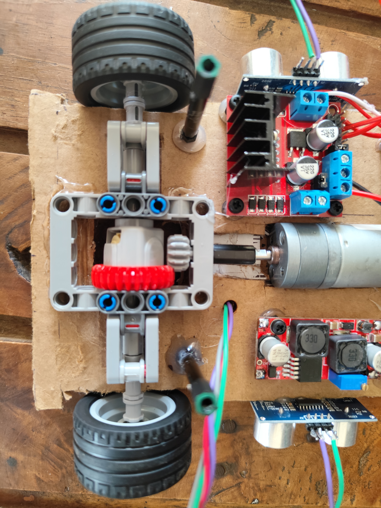 | **LEGOS transmission system** | It allows the engine's power to be distributed between both rear wheels so that the engine can continue turning even if some of the wheels lock up, preventing the engine from suffering any damage. |
| 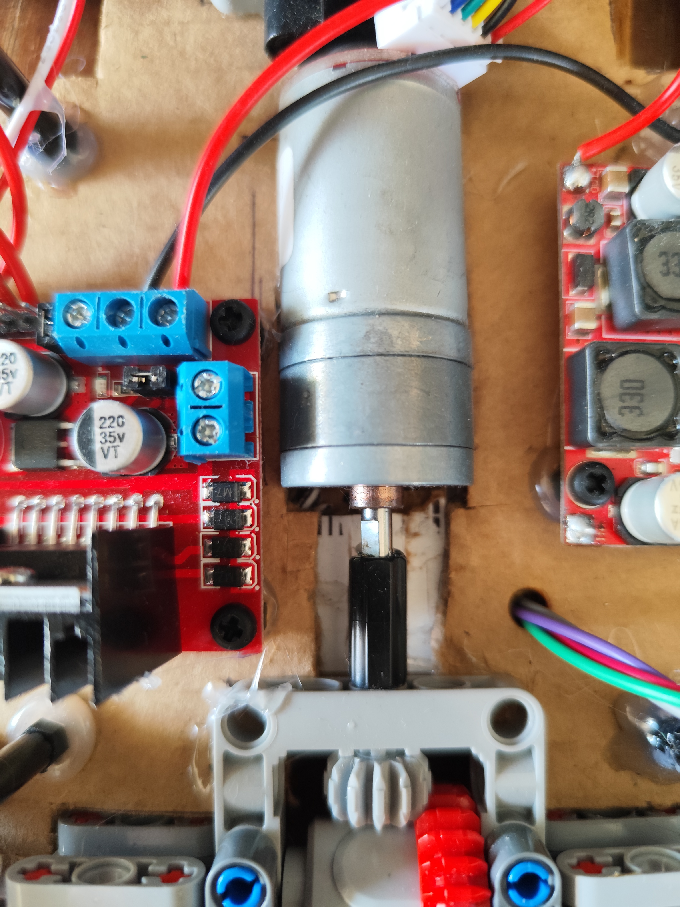 | **25GA370 Motor with Encoder** |It provides the vehicle's traction. The encoder measures the speed and direction of rotation for better motion control. |
| 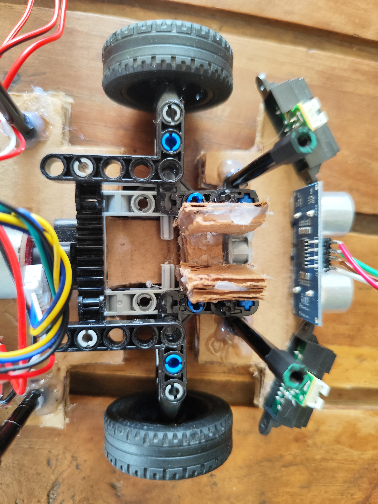 | **180° servo-controlled steering system** | It allows control over the vehicle's movement, moving both front wheels with a 180-degree servomotor, which allows us to achieve good precision when avoiding obstacles. |
|  | **Acrylic separators** | For a comfortable and easy-to-modify assembly, these spacers were used, where you only have to twist the pillars to unscrew them and disassemble the vehicle. |

## Components for detection
| Image | Component Name | Description |
|:------:|:----------------------|:------------|
| 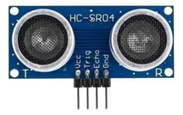 | **Ultrasonic Sensor HC-SR04** | Measures the distance to obstacles using ultrasonic waves. It is used front and side to detect proximity. |
| 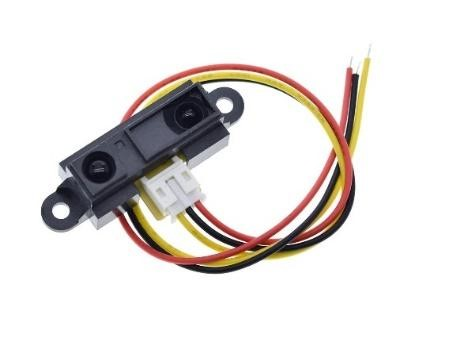 | **Sharp GP2Y0A21YK0F Infrared Sensor** | Ensures fast and accurate object detection. They are located on the vehicle's front diagonals. |
| 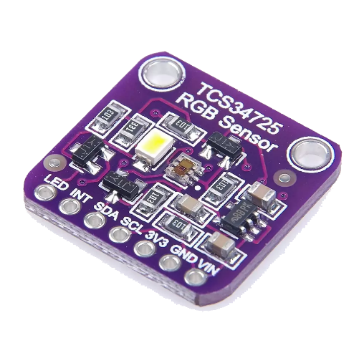 | **TCS34725 Color Sensor** |It allows for precise color detection at a short distance, so it is positioned on the underside of the vehicle, identifying the colors of the track stripes. It has a high sensitivity and a wide dynamic range of 3,800,000:1, and can operate even behind dark glass. |
| 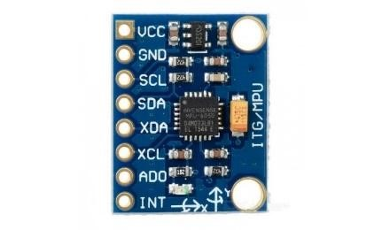 | **MPU6050 Sensor** | The MPU6050 is a 6-degree-of-freedom (DoF) inertial measurement unit (IMU) that combines a 3-axis accelerometer and a 3-axis gyroscope. This sensor is widely used in navigation, direction finding, stabilization, and more. |
| 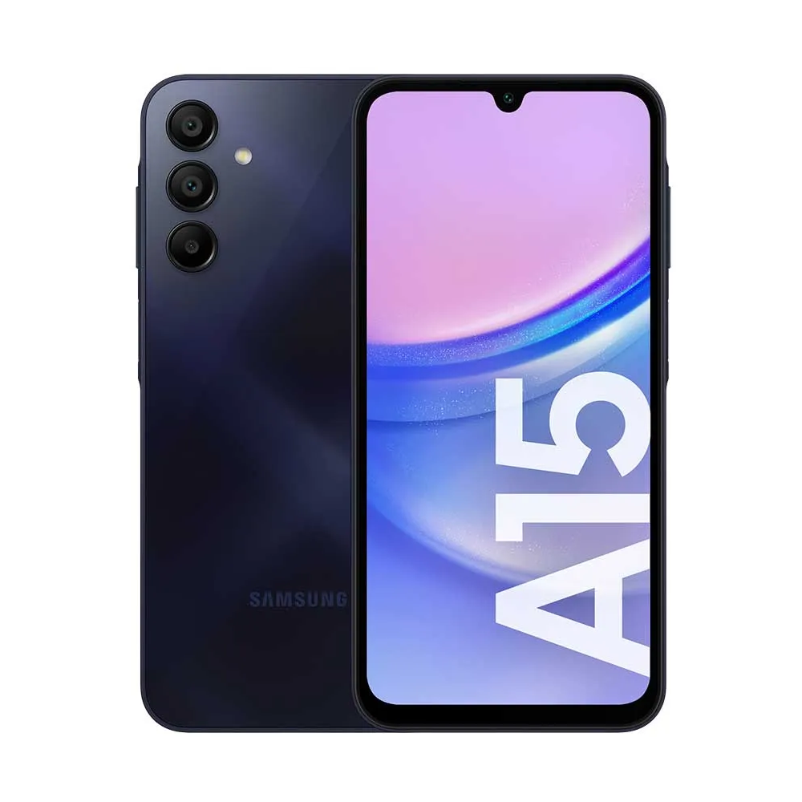 | **Cell phone camera** | Using a program using OpenCV and Android Studio, we will use the cell phone camera to identify the color of obstacles at a great distance. |

## Information processing components
| Image | Component Name | Description |
|:------:|:----------------------|:------------|
| 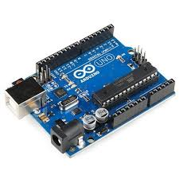 | **Arduino UNO board** | It acts as the brain of the vehicle, connecting and controlling all sensors and motors. |

## Power components
| Image | Component Name | Description |
|:------:|:----------------------|:------------|
| 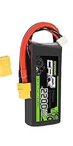 | **BLiPo battery 2200mah 7.4v** | Rechargeable power source that powers the entire system, providing mobility and autonomy. Chosen for its capacity and ability to supply sufficient power to the motors and internal components. |
| 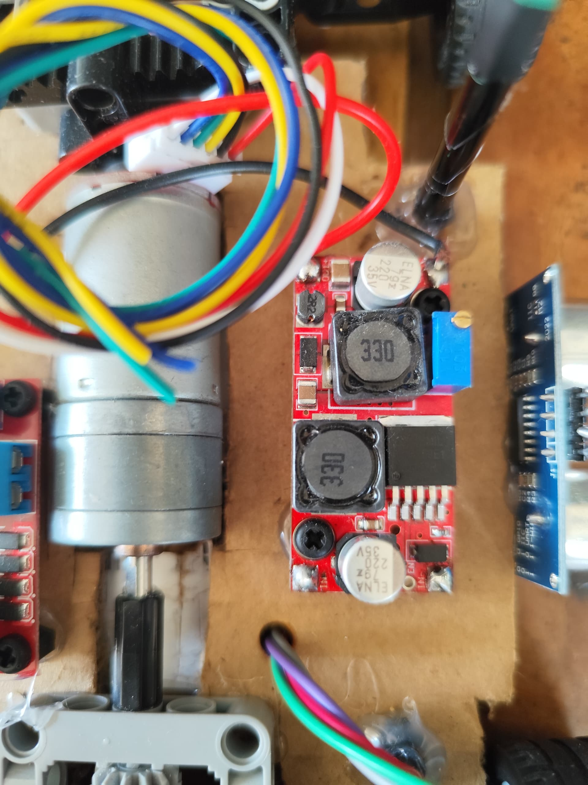 | **LM2596 voltage regulator** | Reduces voltage in the most efficient way. Input voltage: 4.5V to 40V DC. Output voltage: 1.23V to 37V DC. Output current: Max. 3A, 2.5A recommended. |

## Object detection programs
  
 For obstacle detection, we designed a mobile application using Android Studio and implementing the OpenCV library, aiming to improve the robot's environmental detection capabilities. The main function of this application is to detect red and green objects in real time using the mobile device's camera. Once the application identifies the predominant color in the field of view, it sends this information to the Arduino board via a USB connection.
 

Process Flow:
1. Image Capture: The app uses the phone's camera to capture real-time video.

2. Processing with OpenCV: The image is filtered by color to identify whether a red or green object is present in the scene.

3. Communication with Arduino: Once the color is identified, the app sends a specific code or character to the Arduino board (e.g., 'R' for red, 'G' for green).

4. Decision Making: Upon receiving this information, the Arduino executes a preprogrammed action.

## Power supply system
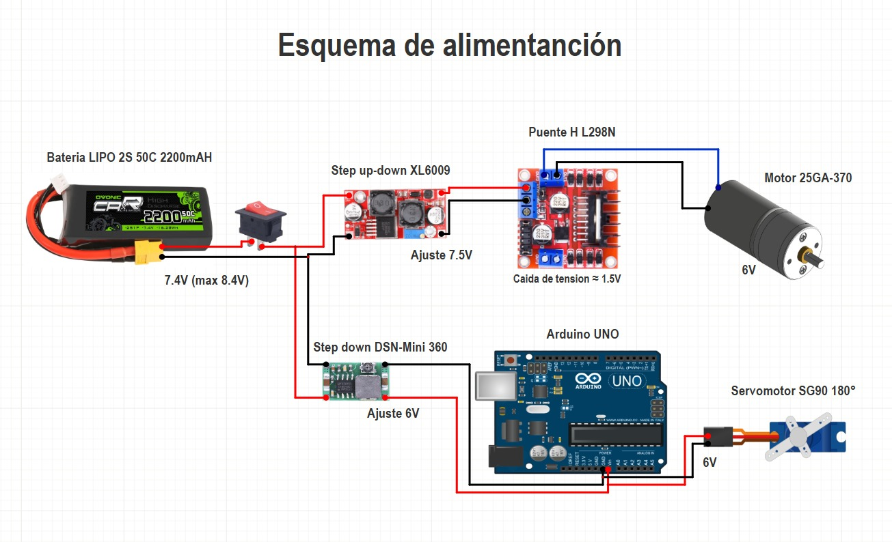 
In this scheme we take all the power from our 2200 mAh LiPo battery with a voltage of 7.4 volts, we interconnect that battery with a switch that will be the main one, which will indicate the ignition of the vehicle's shutoff switch and then pass a branch to the XL6009 voltage regulator with a direct output at 7.5 volts to the L298N module which is an H bridge and with rotation control, which has a voltage drop of 1.5 volts, the output of this H bridge is connected directly to our DC motor and approximately 6 volts will be reaching it, which would be its normal operating voltage.
Then, we branch off the lipo battery to power the Arduino board. This voltage is regulated by a DSN-Mini 360 module set to 6 volts. This output is connected directly to the Vin pin on the Arduino board, where we also connect the servomotor that controls the vehicle's steering.

## Step-by-step construction
   ## Vehicle design and assembly stage
   
   Regarding the design of our vehicle, we began developing a 3D model on the Tinkercad platform to determine the dimensions of our vehicle and the sizes of each of its components. This model    was designed for a two-story vehicle, with the ground floor housing the transmission system, steering system, engine, power system, and sensors—both front, side, and diagonal—alongside. 
| Front | Base | Side |
|:------:|:----------------------|:------------|
| 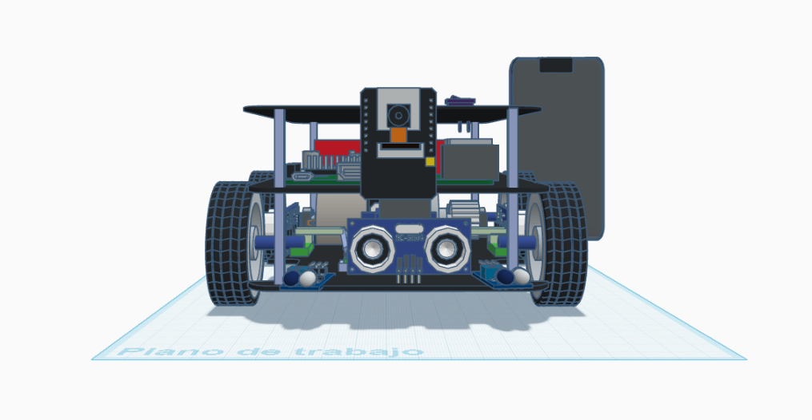 | 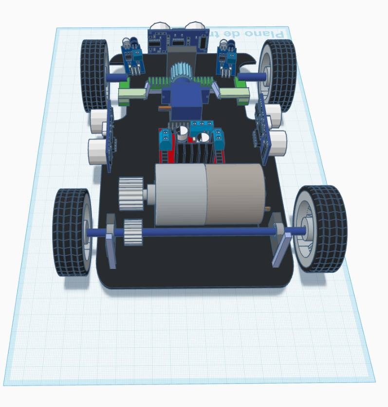 | 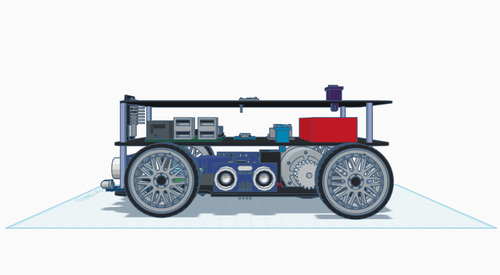 |

   The second floor will house the Arduino and camera. At that time, the camera was not intended to be used with a cell phone, but the idea was being considered. This shows how a cell phone      would interact with our vehicle.
   
   ## Vehicle assembly
  | Image | Description | 
|:------:|:----------------------|
| 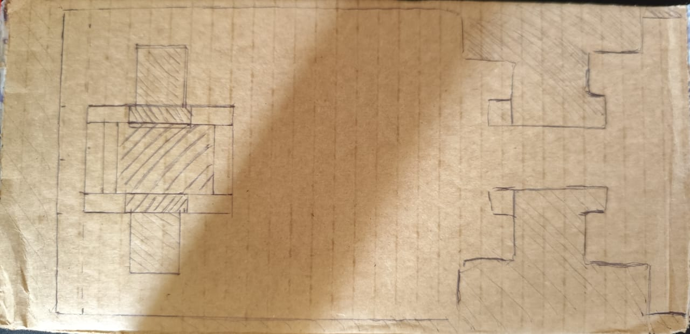 |Here are some already tested measurements for their respective car tests. We're using cardboard so we can make several changes if necessary without incurring additional costs. We'll cover the base with a double layer of cardboard so it won't be too soft and damaged by a little weight. | 
| 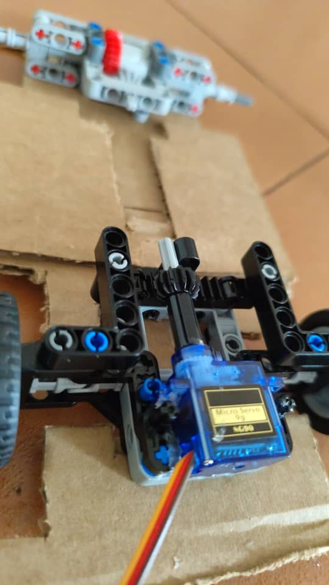 |We placed the Lego transmission on the base and made a few cuts to properly fit the engine, steering, and transmission. Then, we installed the servomotor in the differential and the DC motor in the transmission.  | 
| 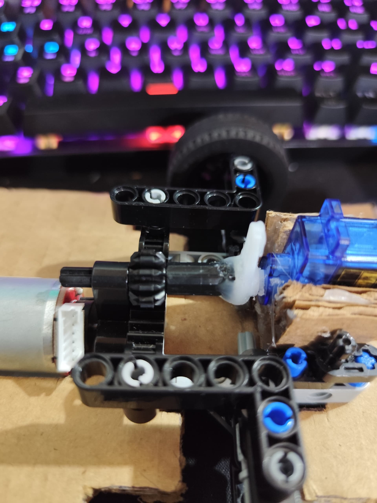 | 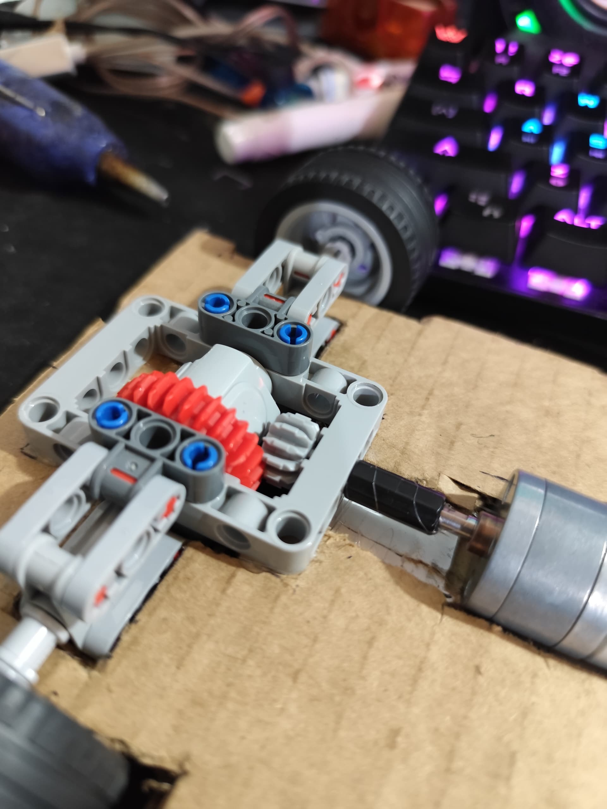| 
| 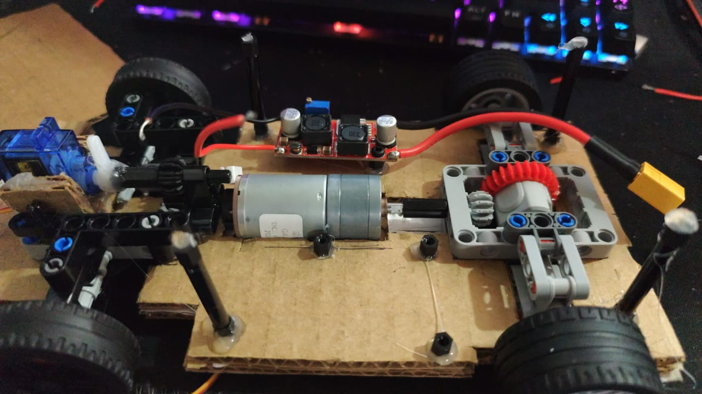 |** Ya con todo lo elemental esamblado conectamos el motor a la alimentacion con el regulador para hacer una prueba rapida de funcionamiento, para observar si el motor y la transmision funcionan adecuadamente.**| 

## Tests performed
  ## color sensor test
  Click on the image to watch the video
  

