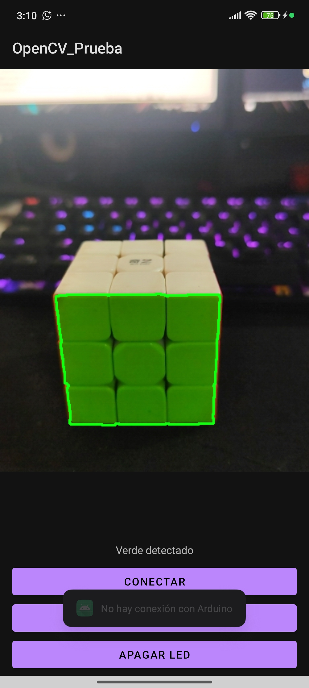
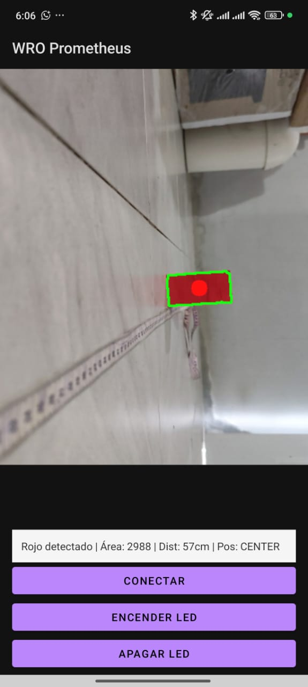
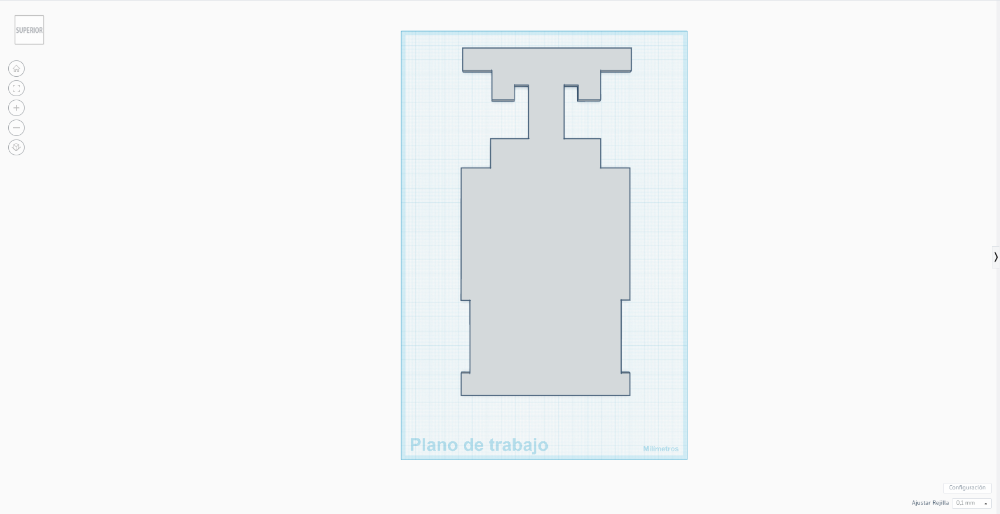
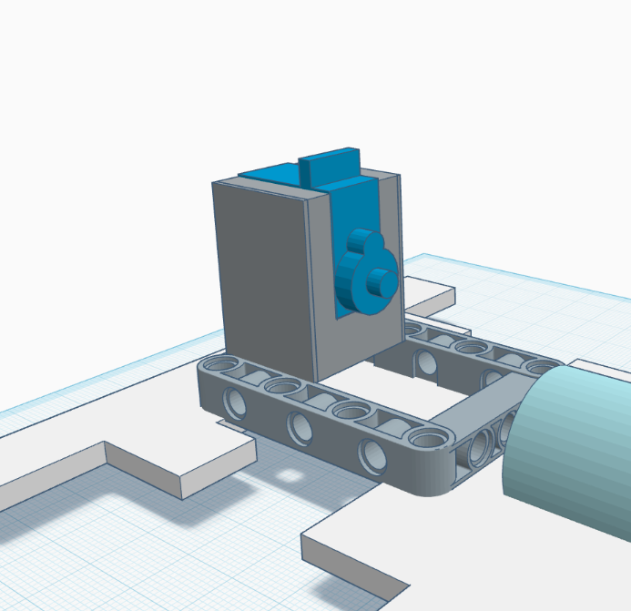
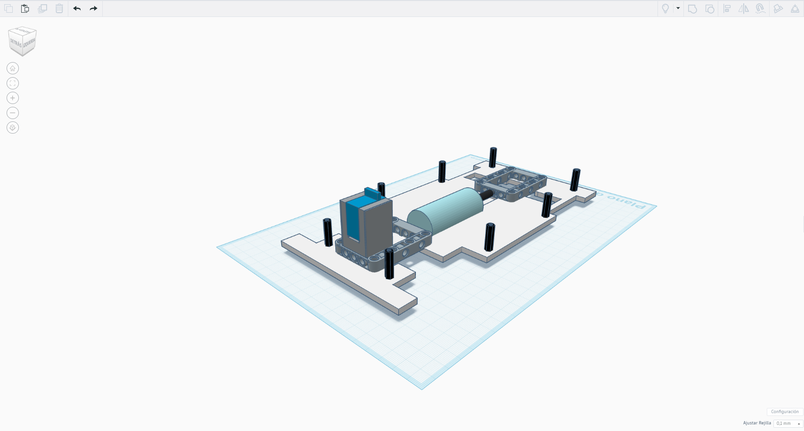
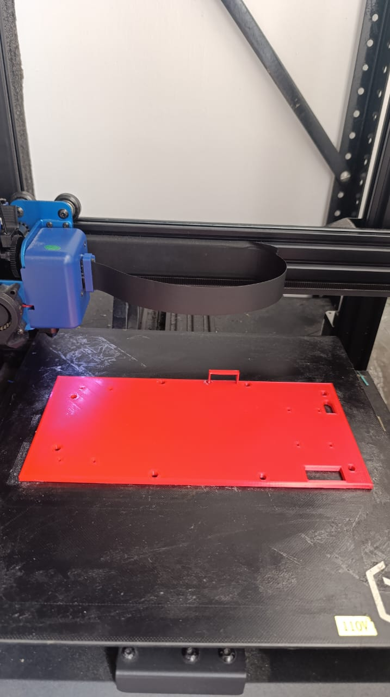
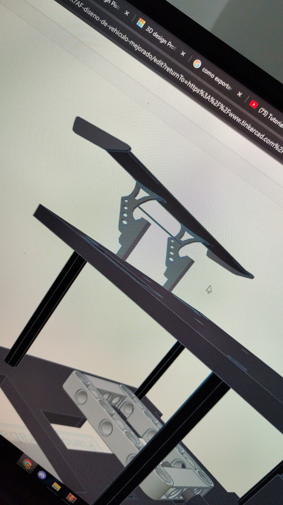
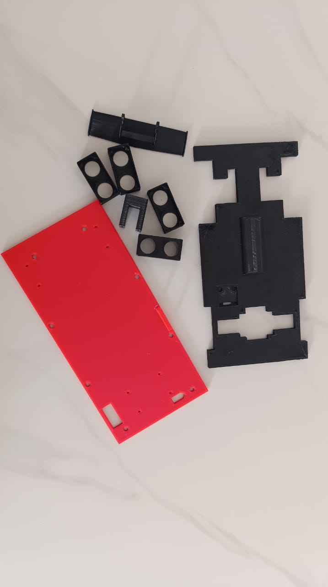

# Prometheus Team

Somos un equipo venezolano que representa con orgullo a la **Universidad Politécnica Territorial José Félix Ribas (UPTJFR)**. Nuestro compromiso es la innovación y el aprendizaje continuo en el campo de la robótica autónoma.

---

##  Índice

* [Contenido del Repositorio](#-contenido-del-repositorio)
* [Introducción al Proyecto](#-introducción-al-proyecto)
* [Diseño de Hardware](#-diseño-de-hardware)
    * [Componentes de Detección](#-componentes-de-detección)
    * [Componentes de Procesamiento de Información](#-componentes-de-procesamiento-de-información)
    * [Componentes de Alimentación](#-componentes-de-alimentación)
* [Programas para Detección de Objetos](#-programas-para-detección-de-objetos)
* [Cálculo de Torque y Velocidad](#-cálculo-de-torque-y-velocidad)
* [Sistema de Alimentación](#-sistema-de-alimentación)
    * [Cálculo del Consumo Energético Total](#-cálculo-del-consumo-energético-total)
    * [Autonomía Estimada](#-autonomía-estimada)
* [Sistema de Detección de Objetos](#-sistema-de-detección-de-objetos)
* [Paso a Paso de la Construcción](#-paso-a-paso-de-la-construcción)
    * [Etapa de Diseño y Ensamblaje del Vehículo](#-etapa-de-diseño-y-ensamblaje-del-vehículo)
    * [Montaje del Vehículo](#-montaje-del-vehículo)
    * [Cambio de Base](#-cambio-de-base)
* [Pruebas Realizadas](#-pruebas-realizadas)
    * [Prueba del Sensor de Color](#-prueba-del-sensor-de-color)

---

##  Contenido del Repositorio

Este repositorio contiene los siguientes directorios para organizar nuestro proyecto:

* `t-photos`: Incluye 2 fotos del equipo (una oficial y una divertida con todos los miembros).
* `v-photos`: Contiene 6 fotos del vehículo (desde todos los ángulos, superior e inferior).
* `video`: Archivo `video.md` con el enlace a un video de demostración de conducción.
* `schemes`: Diagramas esquemáticos (JPEG, PNG o PDF) de los componentes electromecánicos, ilustrando la conexión de elementos electrónicos y motores.
* `src`: Código del software de control para todos los componentes programados para la competición.
* `models`: Archivos para modelos usados por impresoras 3D, cortadoras láser y máquinas CNC para producir elementos del vehículo.
* `other`: Archivos adicionales para entender cómo preparar el vehículo para la competición (documentación de conexión SBC/SBM, carga de archivos, especificaciones de hardware, etc.).

---

##  Introducción al Proyecto

Para esta competición, hemos desarrollado un diseño de vehículo **cómodo, fácil de modificar y sencillo**, donde todos los elementos interactúan a la perfección. Nos enorgullece presentar nuestro primer prototipo de vehículo autónomo con reconocimiento de objetos y colores.

El diseño y la construcción de nuestro vehículo son íntegramente propios. Su **estructura de dos niveles** permite que todos los componentes encajen armoniosamente. Incorpora **vigas de soporte extraíbles** para facilitar el desmontaje, un **sistema de transmisión** tipo LEGO que transfiere la potencia del motor a las ruedas traseras, y un **sistema de dirección** también con piezas LEGO, controlado por un servomotor para mayor precisión en los giros.

Este proyecto ha sido el resultado del esfuerzo y la dedicación de todo nuestro equipo. Cada cable, cada sensor, y cada línea de código es un testimonio de nuestro **esfuerzo técnico y financiero**. No solo construimos un vehículo; demostramos que con pasión y ganas de aprender, se pueden superar los límites.

---
##  Fotos de equipo
|   |  | 
| :----: | :---------- |

---
##  Fotos del vehiculo 
|   |    |   |
| :----: | :------------------- | :---------- |
|   |    |   |

---

##  Diseño de Hardware

| Imagen | Nombre de Componente | Descripción |
| :----: | :------------------- | :---------- |
|  | **Base del Vehículo** | Con medidas de 11.5 cm x 2.5 cm, imita un coche de Fórmula 1, optimizando la distribución de espacio y la movilidad. La parte frontal permite alojar tres sensores (1 ultrasónico central y 2 infrarrojos diagonales). Aunque el cartón inicial presentó debilidades en la dirección, el uso de acrílico o un material más rígido es la solución ideal. |
|  | **Sistema de Transmisión de Legos** | Distribuye la potencia del motor entre ambas ruedas traseras, permitiendo el giro continuo del motor incluso si una rueda se bloquea y evitando daños. Elegido por su facilidad de uso y tamaño adecuado, permite también la reversa. |
|  | **25GA370 Motor DC con Encoder** | Motor común en estos vehículos por su potencia y velocidad. El codificador integrado mide velocidad y dirección (aún no utilizado). **Especificaciones**: Potencia nominal: 4 W, Tensión nominal: 6V, Velocidad nominal: 220 RPM, Peso: 400g, Caja reductora: 21.3:1, Torque nominal: 0.35 kg·cm. |
|  | **Sistema de Dirección** | Construido con piezas LEGO, su tamaño es ideal y permite adaptar un servomotor de 180 grados para controlar el movimiento. El servomotor se centra a 90 grados, gira a la izquierda a 180 grados y a la derecha a 0 grados. |
|  | **Separadores de Acrílico** | Facilitan un montaje cómodo y modular. Girar los pilares permite desatornillar y desmontar el vehículo rápidamente. |

### Componentes de Detección

| Imagen | Nombre de Componente | Descripción |
| :----: | :------------------- | :---------- |
|  | **Sensor Ultrasónico HC-SR04** | Mide la distancia a obstáculos mediante ondas ultrasónicas. Se utiliza frontal y lateralmente para detectar proximidad. |
|  | **Sharp GP2Y0A21YK0F Sensor Infrarrojo** | Garantiza una detección de objetos rápida y precisa. Se ubican en las diagonales delanteras del vehículo. |
|  | **TCS34725 Sensor de Colores** | Permite una detección precisa del color a corta distancia, ubicado en la parte inferior para identificar los colores de las franjas de la pista. Alta sensibilidad y amplio rango dinámico (3.800.000:1), funcionando incluso tras cristales oscuros. |
|  | **MPU6050 Sensor Giroscopio y Acelerómetro** | Unidad de medición inercial (IMU) de 6 grados de libertad (DoF) que combina un acelerómetro y un giroscopio de 3 ejes. Ampliamente utilizado en navegación, radiogoniometría y estabilización. |
|  | **Cámara del Teléfono Celular** | Utilizando una app desarrollada en android studio usando las librerias de OpenCV, el celular en general se usa como procesador de imagenes y la cámara del celular se usa como sensor para identificar el color y los objetos. |

### Componentes de Procesamiento de Información

| Imagen | Nombre de Componente | Descripción |
| :----: | :------------------- | :---------- |
|  | **Microprocesador Arduino Uno** | Actúa como el cerebro del vehículo, conectando y controlando todos los sensores y motores. |

### Componentes de Alimentación

| Imagen | Nombre de Componente | Descripción |
| :----: | :------------------- | :---------- |
|  | **Batería LiPo 2200mAh 7.4V** | Fuente de alimentación recargable que alimenta todo el sistema, proporcionando movilidad y autonomía. Seleccionada por su capacidad para suministrar suficiente energía a los motores y componentes internos. |
|  | **LM2596 Regulador de Voltaje** | Reduce el voltaje de manera eficiente. Voltaje de entrada: 4.5 V a 40 V CC. Voltaje de salida: 1.23 V a 37 V CC. Corriente de salida: Máx. 3 A, se recomiendan 2.5 A. |

---

##  Programas para Detección de Objetos
|  |  |
| :-------------------------------: | :---------------------------------------------: |

Para la detección de obstáculos, hemos desarrollado una **aplicación móvil con Android Studio** que implementa la biblioteca **OpenCV**. Esta aplicación mejora la capacidad de detección del entorno del robot, identificando objetos rojos y verdes en tiempo real mediante la cámara del dispositivo móvil. Una vez que la aplicación identifica el color predominante, envía esta información a la placa Arduino a través de una conexión USB.

### Flujo del Proceso:

1.  **Captura de Imagen:** La aplicación utiliza la cámara del teléfono para capturar vídeo en tiempo real.
2.  **Procesamiento con OpenCV:** La imagen se filtra por color para identificar la presencia de objetos rojos o verdes en la escena.
3.  **Comunicación con Arduino:** Una vez identificado el color, la aplicación envía un código o carácter específico a la placa Arduino (ej., "R" para rojo, "G" para verde).
4.  **Toma de Decisiones:** Al recibir esta información, Arduino ejecuta una acción preprogramada.

|  |  |
| :-------------------------------: | :---------------------------------------------: |
|  |  |
---

##  Cálculo de Torque y Velocidad

### Cálculo de Torque Necesario para Mover el Vehículo:

El torque necesario ($T_{\text{necesario}}$) se calcula mediante la fórmula:
$T_{\text{necesario}} = m \cdot g \cdot r$

Donde:
* $m$ = masa del vehículo (0.943 kg)
* $g$ = gravedad (9.81 $m/s^2$)
* $r$ = radio de las ruedas (0.04 m)

$T_{\text{necesario}} = 0.943 \cdot 9.81 \cdot 0.04 = 0.370 \text{ N} \cdot \text{m}$

### Cálculo de Torque a la Salida (después de la reducción) según el motor DC 25GA370:

$T_{\text{salida}} = T_{\text{motor}} \cdot \text{Reducción}$
$T_{\text{salida}} = 0.0343 \cdot 21.3 = 0.7306 \text{ N} \cdot \text{m}$

### Cálculo de la Velocidad Lineal del Vehículo:

Convertimos la velocidad del motor a radianes por segundo ($\omega$):
$\omega = \frac{220 \cdot 2\pi}{60} = 23.04 \text{ rad/s}$

Velocidad lineal del vehículo ($v$):
$v = \omega \cdot r = 23.04 \cdot 0.04 \approx 0.92 \text{ m/s}$

El motor empleado tiene una velocidad sin carga de 4690 RPM y un torque nominal de 0.35 kg·cm (0.0343 N·m). Mediante una caja reductora de 21.3:1, la velocidad se reduce a 220.2 RPM en el eje de salida, lo que resulta en una velocidad lineal del vehículo de aproximadamente 0.92 m/s.

Gracias a esta reducción, el torque en las ruedas alcanza 0.7306 N·m, lo cual supera el torque mínimo necesario para mover el vehículo de 943 gramos (0.370 N·m). Por lo tanto, el sistema cumple adecuadamente los requerimientos de tracción y movilidad para condiciones normales.

---

##  Sistema de Alimentación

En este esquema, toda la energía proviene de nuestra **batería LiPo de 2200 mAh** con un voltaje de 7.4 voltios. La batería se interconecta con un interruptor principal que indica el encendido del vehículo.

Luego, una rama se dirige al **regulador de voltaje XL6009**, que proporciona una salida directa de 7.5 voltios al **módulo L298N** (un puente H con control de rotación). Este puente H tiene una caída de voltaje de 1.5 voltios, por lo que la salida conectada a nuestro motor DC le suministrará aproximadamente 6 voltios, su voltaje de funcionamiento normal.

Adicionalmente, derivamos la batería LiPo para alimentar la placa **Arduino**. Este voltaje se regula mediante un **módulo DSN-Mini 360** configurado a 6 voltios. Esta salida se conecta directamente al pin Vin de la placa Arduino, donde también conectamos el servomotor que controla la dirección del vehículo.

### Cálculo del Consumo Energético Total

| Componente | Cantidad | Consumo estimado (mA) | Total (mA) |
| :------------------------- | :------- | :-------------------- | :--------- |
| Motor DC | 1 | 500 mA (en carga) | 500 mA |
| Servo 180° | 1 | 150 mA (típico) | 150 mA |
| Sensor ultrasónico HC-SR04 | 3 | 15 mA c/u | 45 mA |
| Sensor infrarrojo Sharp | 2 | 30 mA c/u | 60 mA |
| Sensor TCS34725 (color) | 1 | 3 mA | 3 mA |
| Arduino Uno | 2 | 50 mA c/u (sin carga) | 100 mA |
| **TOTAL** | — | — | **858 mA** |

---

### 🔋 Corriente total aproximada: **~858 mA**

---

### ⏱️ Autonomía Estimada

**Fórmula:**
`Autonomía (h) = Capacidad de la batería (mAh) / Consumo total (mA)`

**Ejemplo con batería de 2200 mAh:**
`Autonomía ≈ 2200 mAh / 858 mA ≈ 2.56 horas`

> ⚠️ *Nota:* Este valor es teórico y asume un consumo constante. En la práctica, el consumo del motor puede aumentar significativamente si se encuentra con un obstáculo, por lo que la autonomía real podría variar.

---

##  Sistema de Detección de Objetos

Cada uno de nuestros sensores desempeña funciones específicas para guiar el vehículo y asegurar que no impacte con ningún obstáculo:

* Los **sensores infrarrojos** están ubicados en las diagonales del vehículo, proporcionando una detección rápida y segura para evitar colisiones sorpresa.
* Los **sensores ultrasónicos** se encuentran al frente y en los laterales del vehículo, midiendo distancias largas para mantener nuestros márgenes de movimiento con respecto a las paredes laterales y la frontal.
* El **sensor giroscopio** nos ayuda a mantener una trayectoria recta a través de la pista y a realizar giros precisos, guiándonos según nuestros grados iniciales.
* Finalmente, nuestro **sensor de color** identifica las líneas en el mapa, permitiéndonos recorrer la pista de manera eficiente.

---

##  Paso a Paso de la Construcción

### Etapa de Diseño y Ensamblaje del Vehículo

El diseño de nuestro vehículo comenzó con un **modelo 3D en Tinkercad** para definir las dimensiones y el tamaño de cada componente. Este modelo se concibió para un vehículo de dos plantas:

* **Planta Baja:** Aloja el sistema de transmisión, sistema de dirección, motor, sistema de potencia y sensores (frontales, laterales y diagonales).
* **Segundo Piso:** Contendrá el Arduino y la cámara (originalmente no se pensó en un teléfono celular, pero se consideró la idea en esta etapa). La imagen muestra cómo un teléfono celular interactuaría con nuestro vehículo.

| Vista Frontal | Vista Base | Vista Lateral |
| :-----------: | :--------: | :-----------: |
|  |  |  |

### Montaje del Vehículo

| Imagen | Descripción |
| :----: | :---------- |
|  | Aquí se muestran algunas medidas ya probadas para las primeras pruebas del coche. Utilizamos cartón como material de prueba para realizar cambios sin incurrir en costos adicionales. La base se cubrió con una doble capa de cartón para mayor rigidez. |
|  | Colocamos la transmisión LEGO en la base y realizamos los cortes necesarios para que el motor, la dirección y la transmisión encajaran correctamente. Luego, instalamos el servomotor en el diferencial y el motor DC en la transmisión. |
|  | Encaje del servomotor con el sistema de direccion. |
|   | Encaje de motor dc con el sistema de transmision. |
|  | Con todos los elementos esenciales ensamblados, conectamos el motor a la alimentación con el regulador para una prueba de funcionamiento rápida, verificando el correcto desempeño del motor y la transmisión. |

### Diseño de base 3d
Teniendo en cuenta el modelo diseñado en carton empezamos con la modelacion en 3d de nuestro vehiculo para construirlo con un material mas resistente que no sufra los defectos de nuestra primera base de carton.

|  |  |
| :----: | :---------- |
|  |  |
||  |
|  |  |
|  | Diseñamos una base para servo para que se ajuste de manera acorde a la base y se mantenga firme al momento de mover la transmision,  un protector para los sensores ultrasonicos y el aleron trasero para seguir con la idea de asemejarnos a un vehiculo de formula uno. Todos estos modelos estaran en la carpeta de models. |

---

## Cambio de Base

| Imagen | Descripción |
| :----: | :---------- |
|  | Realizamos un cambio del material de la base. El cartón fue el material de prueba para modificar el diseño de todas las maneras posibles. Con el molde final de nuestro vehículo, procedimos a imprimir la base en 3D. |
|  | Inicio del proceso de cambio de base, montando la transmisión y el diferencial del vehículo. |
|  |  |
|  | Se continúa con el ensamblaje de la nueva base. |

## Problemas encontrados. 

### interferencia con el puente H, solución: Un sistema maestro y esclavo.

Al momento de realizar las pruebas de vueltas a la pista nos percatamos que el vehículo no respondía correctamente y al momento de realizar a el giro nunca terminaba de realizarlo o simplemente no detectaba la línea y por esto no lo realizaba. Entre mucha investigación encontramos que la falla era una interferencia con los pines que mandaban las señales al modulo de puente H. Por lo que buscamos aislar estos cables resultando sin éxitos. 
La solución probada fue conectado un segundo microcontrolador Arduino esclavo, encargado exclusivamente de enviar los comandos de avanzar, retroceder, detenerse y algún cambio de velocidad al módulo puente H, mientras que el Arduino principal en este caso el maestro, llevara todos los sensores y cables conectados al esclavo para indicarle que acción debe ejecutar el puente H. 
De esta manera logramos distanciar esta interferencia y el código fluía continuamente sin problemas

#### Diagrama del codigo del microcontrolador arduino esclavo.

---

## Pruebas Realizadas

### Prueba del Sensor de Color

Haz clic en la imagen para ver el vídeo:

### Fabricacion de pista a escala

Para las pruebas, creamos una imitación de la pista de competición utilizando láminas recicladas, pegadas para cumplir con los estándares de 3x3 metros. Nuestra pista tiene un ligero error de aproximadamente 10 cm. Las esquinas de la pista deben tener dos líneas, una azul y otra naranja, separadas por 30 grados cada una, tomando el mismo origen que la esquina interior del cuadrado.

## Desarrollo de la logica de vueltas a la pista

Para este momento ya teníamos idea de la lógica de nuestro primer código del primer desafío que seria la vuelta libre a la pista. En esta lógica usaremos las líneas de la pista para marca el momento exacto para cruzar y el conteo de vueltas siendo 4 líneas igual a una vuelta y así cumplir las 3 vueltas que serían 12 líneas, con el sensor giroscopio(mpu6050) mediremos los grados que va girando el vehículo para calcular exactamente los 90grados del cruce de la esquina. Un planteamiento básico que nos sirvió como comienzo. A partir de aquí presentamos los siguientes problemas. 
•	Falta de detección de líneas: Con el sistema de detección de color tuvimos problemas para detectar las líneas ya que había veces que no la detectaba por la velocidad del vehículo por lo que aumentamos la tasa de refresco a :
Adafruit_TCS34725 tcs = Adafruit_TCS34725(TCS34725_INTEGRATIONTIME_2_4MS, TCS34725_GAIN_1X);
INTEGRATIONTIME _2_4MS es el tiempo de integración, que es el tiempo que la carama recoge luz para hacer una lectura y el Gain_1X es la ganancia que es un factor de amplificación que se aplica a la señal de los fotodiodos antes de la conversión analógica a digital.

•	Sobre detección y detección errónea: Detectaba la línea más de una vez y en algunas zonas por la diferencia de luz podía tomar un color distinto como azul o naranja, por lo que desarrollamos una lógica que saca el promedio de las ultimas 3 mediciones para garantizarnos que si era la línea azul y que no tomara el comando mas de una vez.

•	Desviación: Luego se utilizó un sistema de centrado con 2 sensores ultrasónicos laterales para corregir el problema de que el vehículo no quedaba exactamente con 90 grados al momento después de terminar el cruce. Este sistema compara ambas distancias e intenta mover el servomotor para que cruce en dirección al lado con mayor distancia. Esto luego fue robustecido con un sistema PID que hace correcciones diferentes según el nivel de desviación para una corrección leve si la desviación es poca o fuerte si es grande. 
El ángulo de cruce que el mpu suma al ángulo actual fue modificado de 90 a 70 ya que el sensor giroscopio cuando llegaba su medición a 90 grados el vehículo cruzaba de más por lo que fuimos calibrando manualmente este valor hasta 70 grados con el que el vehículo se logró desempeñar mejor en las pruebas. Este valor puede ser distinto dependiendo de la calibración o posición de montaje del sensor por eso es mejor calibrarlo cada quien en sus montajes mediante las pruebas.

Para culminar con este código realzamos la lógica necesaria para cumplir con la condición de que el vehículo girara en ambos independientemente (horario y antihorario). Por lo que pensamos en una lógica para que el vehículo dependiendo de la línea que se encontrase primero sería el sentido de la vuelta si es azul es horario y si es naranja es antihorario. Para la lógica de antihorario seria restar 70 grados al ángulo actual y girar a la izquierda en lugar de la derecha como en la lógica pasada. 

### Diagrama de logica de vueltas a la pista.
 

### Diagrama de logica PID del centrado y giro.
 

## Desarrollo de la logica de evasion de objetos.

   Para la lógica de evasión de objetos tomamos los ejemplos de otro proyecto donde se utilizan las cámaras para procesar las imágenes y mediante programas como open Cv analizar la imagen en búsquedas de figuras y colores par así tener una idea del objeto que tenemos en el rango de visualización y de su ubicación. Nos tomó un tiempo desarrollar una aplicación para teléfonos móviles para usar la cámara de estos y procesar las imágenes empezando con una app simple donde mandábamos comandos al Arduino para asegurarnos que si se pudiera realizar la conexión entre estos dispositivos hasta realizar la aplicación y mandar comandos simples de R(Red) cuando se detecta un objeto rojo y G (Green) cuando se detecta un objeto verde. 
#Problema: No saber la distancia del objeto.
Al momento de realizar las pruebas con el Arduino nos dimos cuenta que también necesitábamos encontrar la manera de calcular la distancia del objeto mediante la cámara, por lo que llegaos a la solución que mediante el área detectada del objeto aplicaríamos una formula para que esta me diera la distancia aproximada del objeto y saber cuando esquivar. 

### Primer esquive:
Ya con app lista desarrollamos una lógica para el microcontrolador Arduino y de esta manera recibir los comandos de color del objeto, distancia. Realizando una prueba controlada tuvimos unos errores con la iluminación que nos afectaba el reconocimiento de los colores por que tuvimos que ajustar los valores de los colores para mejorar la detección del objeto que termino siendo mejor pero todavía le faltan mejoras, pero cumplió con el objetivo de identificar el objeto y darnos su distancia aproximada, que a 30 cm el Arduino deberá realizar el giro a la derecha si es rojo(R) y a la izquierda si es verde(G), con un retorno al lado contrario luego de realizar el giro para reincorporarse al centro del carril de la pista. 

   ### Orientacion hacia el objeto para posterior esquive.
Problema: El vehículo cuando no está perfectamente en dirección al objeto este ejecutara el esquive pero lo derribara o simplemente perderá de vista el objeto ya que su dirección no va hacia el, por tal razón pensamos en una lógica para que dependiendo de la posición del objeto en la cámara de la del teléfono mandara comandos como C(centro), D(derecha) y I(izquierda), de esta manera ir moviendo de forma controlada la dirección según el comando recibido apenas se capte el objeto en la visión de la cámara. Con este cambio realizado el vehículo se posiciona de manera adecuada frente al objeto a esquivar y realiza su movimiento preciso para esquivar y al retornar al centro.

Problema: al momento de retornar al centro puede que haya un objeto fuera de ranga de la cámara por que al momento de esquivar si se veía pero este modo no es capaz de comenzar el seguimiento así que se le agregó que si detecta otro objeto mientras este en modo de retorno cambie a modo de seguimiento nuevamente.

Aquí dejo el paso a paso de la realización de la app:

### Diagrama de logica de evasion de objetos
 
 
## Video resumen de las pruebas de vuelta a la pista y esquive de objetos.

Haz clic en la imagen para ver el vídeo:

## Prueba de vueltas a la pista

Haz clic en la imagen para ver el vídeo:

## Prueba de evacion de obstaculos

Haz clic en la imagen para ver el vídeo:

